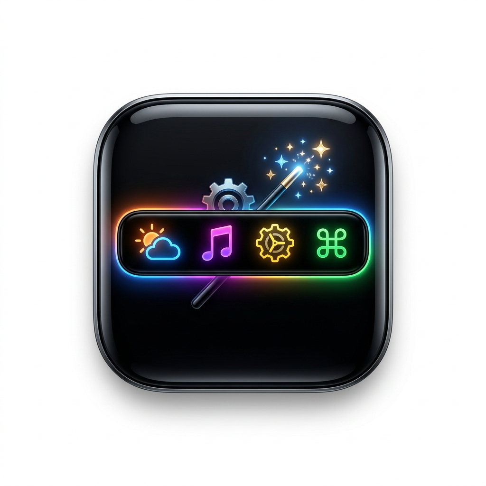

# 💻 TouchBarCraft

<p align="center">
  
</p>

<p align="center">
  <strong>Craft and customize your macOS Touch Bar with modern, dynamic widgets.</strong>
</p>

---

**TouchBarCraft** is a lightweight, high-performance utility written in Swift and SwiftUI that allows you to take full control of your macOS Touch Bar. It overrides the default system Control Strip with custom, interactive widgets configured directly from a modern GUI.

> [!WARNING]
> **Experimental AI-Generated Project**
>
> This repository is fully generated by AI (Artificial Intelligence). As an experimental prototype, it may contain bugs, performance limitations, or incomplete features. Feel free to open issues or contribute to help improve it!

---

## ✨ Features

- **🗂 Supercharged Anki Integration**: Full support for studying flashcards directly on your Touch Bar!
  - Syncs seamlessly with **AnkiConnect** (localhost:8765).
  - Displays dynamic question and answer texts with bold/italic HTML tag rendering.
  - Supports quick deck syncing and audio playback (play/stop) for sound‑enabled cards.
  - Fully custom ease rating buttons (Again, Hard, Good, Easy) customizable from the GUI.
- **Global Touch Bar Override**: Fully replaces the native macOS Touch Bar system-wide.
- **System Tray Menu Bar Item**: Quick access to controls and settings right from your macOS Menu Bar.
- **Launch at Login (Autostart)**: Uses Apple's modern `SMAppService` API to launch at startup seamlessly.
- **Custom JSON Configuration**: Widgets are dynamically saved and loaded from `~/.touchbarcraft.json`.

---

## 🗂 Anki Integration Guide
The standout feature of TouchBarCraft is its powerful, native **Anki Flashcard integration** built directly into your Touch Bar. Review cards passively or actively throughout your day without distracting you from your work.

### 🌟 Key Anki Features
* **Live Connection Status**: Automatically detects if Anki is open and connected. Shows a quick "Connect" option right on your Touch Bar if it is offline.
* **HTML Styling Support**: Richly parses bold (`<b>` / `<strong>`), italic (`<i>` / `<em>`), and underline (`<u>`) tags. Highlighted bold text uses custom colors customizable directly via settings!
* **Configurable Ratings**: Choose which rating buttons show up (Again, Hard, Good, Easy) and customize how many options appear depending on your preferences.
* **Seamless Audio**: Includes a play/stop toggle button right on the Touch Bar for cards with media sound files.
* **Manual Sync**: Sync your decks instantly using the dedicated reload icon.

### 🚀 Getting Started with Anki
1. Open Anki on your Mac.
2. Install the **AnkiConnect** add-on (Code: `2055492159`).
3. Make sure AnkiConnect is running on the default port `8765`.
4. Add the **Anki Review** widget using TouchBarCraft Settings and select your deck. You're ready to learn!

---
# Screenshoot


---

## 🛠 Available Widgets

| Widget Type | Description |
| :--- | :--- |
| **🏷 Label** | Dynamic text output supporting placeholders like `{time}` and `{date}`. |
| **⚡️ Button** | Custom action buttons that can execute shell commands, play sounds, toggle Dark Mode, or sleep/lock the screen. |
| **📊 System Monitor** | Real-time monitoring of CPU usage, RAM usage, and battery/charging status. |
| **🎵 Media Controller** | Media control widget supporting play/pause status and current playback. |
| **🐈 Animation** | Add custom pets (like an animated cat) and control frame speed on your Touch Bar. |
| **🗂 Anki Integration** | Syncs with `AnkiConnect` to track your daily review deck progress and card due counts. |
| **🔊 Volume Slider** | Adjust system audio volume using a native Touch Bar slider control. |
| **🔆 Brightness Buttons** | Quickly increase or decrease screen brightness. |

---

## ⚙️ How to Build and Run

### Prerequisites
- macOS 14.0 or newer
- Swift 5.9+ / Xcode Command Line Tools

### 1. Build the App
Run the provided build script to compile the application and package it into a standard macOS `.app` bundle:
```bash
chmod +x build_app.sh
./build_app.sh
```

This compiles `TouchBarCraft` in release mode and bundles it into `TouchBarCraft.app` in your project root.

### 2. Run the App
- Double-click **`TouchBarCraft.app`** in Finder to launch it.
- **Recommendation**: Move `TouchBarCraft.app` to your `/Applications` directory to allow macOS to register it for the *Launch at Login* service properly.

---

## 🔧 JSON Configuration (`~/.touchbarcraft.json`)

Your custom layout is stored in a clean JSON format. An example structure:

```json
[
  {
    "type": "label",
    "title": "👋 TouchBarCraft!",
    "iconName": "sparkles",
    "backgroundColorHex": "#8B5CF6",
    "textColorHex": "#FFFFFF"
  },
  {
    "type": "systemMonitor",
    "title": "CPU",
    "iconName": "cpu",
    "backgroundColorHex": "#10B981",
    "monitorType": "cpu"
  }
]
```

---

## 📝 License
This project is open-source. Feel free to customize and craft your own widgets!
